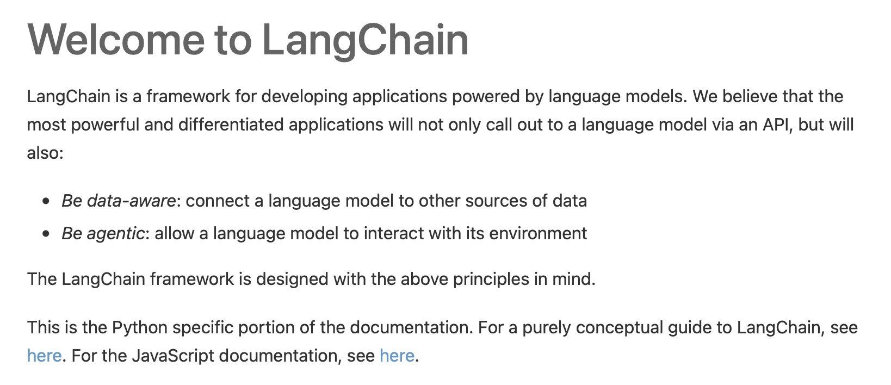

# Awesome-ComposableAI

A curated list of Composable AI methods: Building AI system by composing modules.

It includes *Composable-Model*, *Composable-Task*, *Composable-Gen*, *Composable-Agent*, and *Composable-X*, etc.

**Contributions are welcome!**

𓏠𓏠𓏠𓏠𓏠𓏠𓏠𓏠𓏠
<b>Let's build AI as Lego!<b>
𓏠𓏠𓏠𓏠𓏠𓏠𓏠𓏠𓏠

### Table of Content
- [Awesome-ComposableAI](#awesome-composableai)
    - [Table of Content](#table-of-content)
    - [Definition](#definition)
  - [Composable-Task](#composable-task)
    - [Projects \& Papers](#projects--papers)
    - [Project Only](#project-only)
  - [Composable-Model](#composable-model)
    - [Projects \& Papers](#projects--papers-1)
  - [Composable-Gen](#composable-gen)
    - [Projects \& Papers](#projects--papers-2)
  - [Composable-Agent](#composable-agent)
    - [Paper Only](#paper-only)
  - [Composable-Product](#composable-product)
  - [Composable-X](#composable-x)

### Definition

A paramount issue in AI is the **combinational challenge**: It is infeasible to enumerate all possibilities for an intelligent system.

**Composable AI** offers a solution to this challenge by emphasizing the creation of modular, flexible, and reusable AI components. These components can be assembled and reconfigured in various ways, enabling the construction of customized AI systems that are specifically tailored to individual tasks, domains, or applications.

## Composable-Task

### Projects & Papers
| Title & Authors | Intro | Useful Links |
|:----|  :----: | :---:|
| [**HuggingGPT: Solving AI Tasks with ChatGPT and its Friends in HuggingFace**](https://arxiv.org/abs/2303.17580)   *Yongliang Shen, Kaitao Song, Xu Tan, Dongsheng Li, Weiming Lu, Yueting Zhuang*   Preprint'23    [[**Jarvis (Project)**](https://github.com/microsoft/JARVIS)] |   | [[Github](https://github.com/microsoft/JARVIS)]   [[Demo](https://huggingface.co/spaces/microsoft/HuggingGPT)] |
| [**MM-REACT: Prompting ChatGPT for Multimodal Reasoning and Action**](https://arxiv.org/abs/2303.17580)   *Zhengyuan Yang, Linjie Li, Jianfeng Wang, Kevin Lin, Ehsan Azarnasab, Faisal Ahmed, Zicheng Liu, Ce Liu, Michael Zeng, Lijuan Wang*   Preprint'23    [[**MM-REACT (Project)**](https://github.com/microsoft/JARVIS)] |   | [[Github](https://github.com/microsoft/MM-REACT)]   [[Page](https://multimodal-react.github.io)] [[Demo](https://huggingface.co/spaces/microsoft-cognitive-service/mm-react)] |
| [**TaskMatrix.AI: Completing Tasks by Connecting Foundation Models with Millions of APIs**](https://arxiv.org/abs/2303.16434)   *Yaobo Liang, Chenfei Wu, Ting Song, Wenshan Wu, Yan Xia, Yu Liu, Yang Ou, Shuai Lu, Lei Ji, Shaoguang Mao, Yun Wang, Linjun Shou, Ming Gong, Nan Duan* Preprint'23 |  | [[Github](https://github.com/microsoft/visual-chatgpt/tree/main/TaskMatrix.AI)] |
| [**OpenAGI: When LLM Meets Domain Experts**](https://arxiv.org/pdf/2304.04370.pdf)   *Yingqiang Ge, Wenyue Hua, Jianchao Ji, Juntao Tan, Shuyuan Xu, Yongfeng Zhang*    [[**OpenAGI (Project)**](https://github.com/agiresearch/OpenAGI)] |  | [Github](https://github.com/agiresearch/OpenAGI) |
| [**ChatGPT Asks, BLIP-2 Answers: Automatic Questioning Towards Enriched Visual Descriptions**](https://arxiv.org/abs/2303.06594)   *Deyao Zhu, Jun Chen, Kilichbek Haydarov, Xiaoqian Shen, Wenxuan Zhang, Mohamed Elhoseiny*  Preprint'23  [[**ChatCaptioner (Project)**](https://github.com/Vision-CAIR/ChatCaptioner)] |  | [Github](https://github.com/Vision-CAIR/ChatCaptioner) |
| [**Visual Programming: Compositional visual reasoning without training**](https://arxiv.org/abs/2211.11559)  *Tanmay Gupta, Aniruddha Kembhavi*  CVPR'23  [**Visprog (Project)**](https://github.com/allenai/visprog)|  | [[Github](https://github.com/allenai/visprog)]   [[Page](https://prior.allenai.org/projects/visprog)]|
| [**ViperGPT: Visual Inference via Python Execution for Reasoning**](https://arxiv.org/abs/2303.08128)  *Dídac Surís, Sachit Menon, Carl Vondrick*  CVPR'23  [**Viper (Project)**](https://github.com/cvlab-columbia/viper)|  | [[Github](https://github.com/cvlab-columbia/viper)]   [[Page](https://viper.cs.columbia.edu)]|

### Project Only
| Title & Authors | Intro | Useful Links |
|:----|  :----: | :---:|
|  [**Grounded-SAM (Project)**](https://github.com/IDEA-Research/Grounded-Segment-Anything)  [**Grounding DINO + Segment-Anything + X**]   *Shilong Liu and Zhaoyang Zeng and Tianhe Ren and Feng Li and Hao Zhang and Jie Yang and Chunyuan Li and Jianwei Yang and Hang Su and Jun Zhu and Lei Zhang*  |  | [[Github](https://github.com/IDEA-Research/Grounded-Segment-Anything)]   [[Demo](https://colab.research.google.com/github/roboflow-ai/notebooks/blob/main/notebooks/zero-shot-object-detection-with-grounding-dino.ipynb)] |
| [**Semantic-Segment-Anything (Project)**](https://github.com/fudan-zvg/Semantic-Segment-Anything)  [**Close-set Segmenters + Open-vocabulary Models**]  *Jiaqi Chen, Zeyu Yang, Li Zhang*   |  | [[Github](https://github.com/fudan-zvg/Semantic-Segment-Anything)] |
| [**Segment Anything and Name It (Project)**](https://github.com/Cheems-Seminar/segment-anything-and-name-it) [**Visual ChatGPT + GLIP + Segment-Anything**]  *Peize Sun* and *Shoufa Chen* |  | [[Github](https://github.com/Cheems-Seminar/segment-anything-and-name-it)]
<!-- ### Papers -->
## Composable-Model
### Projects & Papers

| Title & Authors | Intro | Useful Links |
|:----|  :----: | :---:|
| [**AdapterHub: A Framework for Adapting Transformers**]()   *Álvaro Barbero Jiménez*   EMNLP'20    [[**adapter-transformers (Project)**](https://github.com/adapter-hub/adapter-transformers)] |   | [[Github](https://github.com/adapter-hub/adapter-transformers)]   [[Page](https://adapterhub.ml)] |
| [**Deep Model Reassembly**](https://arxiv.org/abs/2210.17409)   *Xingyi Yang, Daquan Zhou, Songhua Liu, Jingwen Ye, Xinchao Wang*   NeurIPS'22    [[**DeRy (Project)**](https://github.com/Adamdad/DeRy)]    |  | [[Github](https://github.com/Adamdad/DeRy)]   [[Page](https://adamdad.github.io/dery/)] |
| [**Outrageously Large Neural Networks: The Sparsely-Gated Mixture-of-Experts Layer**](https://arxiv.org/abs/1701.06538)   *Noam Shazeer, Azalia Mirhoseini, Krzysztof Maziarz, Andy Davis, Quoc Le, Geoffrey Hinton, Jeff Dean*   ICLR'17    [[**mixture-of-experts (Project)**](https://github.com/davidmrau/mixture-of-experts)]    |  | [[Github](https://github.com/davidmrau/mixture-of-experts)] |
## Composable-Gen
### Projects & Papers

| Title & Authors | Intro | Useful Links |
|:----|  :----: | :---:|
| [**Mixture of Diffusers for scene composition and high resolution image generation**](https://arxiv.org/abs/2302.02412)   *Álvaro Barbero Jiménez*   Preprint'23    [[**Mixture-of-Diffusers (Project)**](https://github.com/albarji/mixture-of-diffusers)] |   | [[Github](https://github.com/albarji/mixture-of-diffusers)]   [[Demo](https://huggingface.co/spaces/albarji/mixture-of-diffusers)] |
| [**Compositional Visual Generation with Composable Diffusion Models**](https://arxiv.org/abs/2206.01714)   *Nan Liu, Shuang Li, Yilun Du, Antonio Torralba, Joshua B. Tenenbaum*   ECCV'22    [[**Composable Diffusion (Project)**](https://github.com/energy-based-model/Compositional-Visual-Generation-with-Composable-Diffusion-Models-PyTorch)] |   | [[Github](https://github.com/energy-based-model/Compositional-Visual-Generation-with-Composable-Diffusion-Models-PyTorch)]   [[Demo](https://huggingface.co/spaces/Shuang59/Composable-Diffusion)]   [[Page](https://energy-based-model.github.io/Compositional-Visual-Generation-with-Composable-Diffusion-Models/)]|
| [**Training-Free Structured Diffusion Guidance for Compositional Text-to-Image Synthesis**](https://arxiv.org/abs/2212.05032)   *Weixi Feng, Xuehai He, Tsu-Jui Fu, Varun Jampani, Arjun Akula, Pradyumna Narayana, Sugato Basu, Xin Eric Wang, William Yang Wang*   ICLR'23    [[**Structured-Diffusion-Guidance (Project)**](https://github.com/weixi-feng/Structured-Diffusion-Guidance)] |   | [[Github](https://github.com/weixi-feng/Structured-Diffusion-Guidance)]   [[Page](https://weixi-feng.github.io/structure-diffusion-guidance/)] |
| [**Reduce, Reuse, Recycle: Compositional Generation with Energy-Based Diffusion Models and MCMC**](https://arxiv.org/abs/2212.05032)   *Yilun Du, Conor Durkan, Robin Strudel, Joshua B. Tenenbaum, Sander Dieleman, Rob Fergus, Jascha Sohl-Dickstein, Arnaud Doucet, Will Grathwohl*   Preprint'23    [[**reduce_reuse_recycle (Project)**](https://github.com/yilundu/reduce_reuse_recycle)] |   | [[Github](https://github.com/yilundu/reduce_reuse_recycle)]   [[Page](https://energy-based-model.github.io/reduce-reuse-recycle/)] |
| [**Learning to Compose Visual Relations**](https://arxiv.org/abs/2111.09297)   *Nan Liu, Shuang Li, Yilun Du, Joshua B. Tenenbaum, Antonio Torralba*   NeurIPS'21    [[**compose-visual-relations (Project)**](https://github.com/nanlliu/compose-visual-relations)] |  | [[Github](https://github.com/nanlliu/compose-visual-relations)]   [[Page](https://composevisualrelations.github.io/)] |

## Composable-Agent
### Paper Only
- MCP: Learning Composable Hierarchical Control with Multiplicative Compositional Policies 
  *Xue Bin Peng, Michael Chang, Grace Zhang, Pieter Abbeel, Sergey Levine*
  NeurIPS'19 [[Paper](https://proceedings.neurips.cc/paper_files/paper/2019/file/95192c98732387165bf8e396c0f2dad2-Paper.pdf)]
- Composable Planning with Attributes
  *Amy Zhang, Sainbayar Sukhbaatar, Adam Lerer, Arthur Szlam, Rob Fergus*
  ICML'18 [[Paper](http://proceedings.mlr.press/v80/zhang18k/zhang18k.pdf)]

## Composable-Product

| Title & Authors | Intro | Useful Links |
|:----|  :----: | :---:|
| [**langchain (Project)**](https://github.com/hwchase17/langchain)  [**LLM + X**] |  |[Github](https://github.com/hwchase17/langchain)|

## Composable-X

TO BE UPDATE